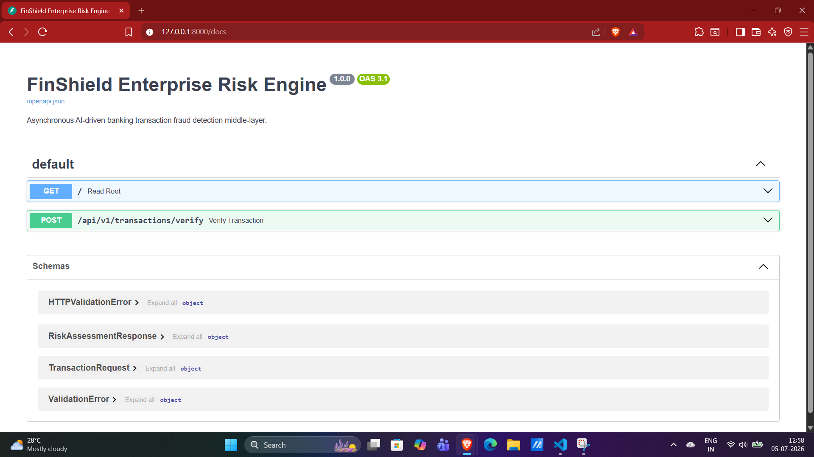
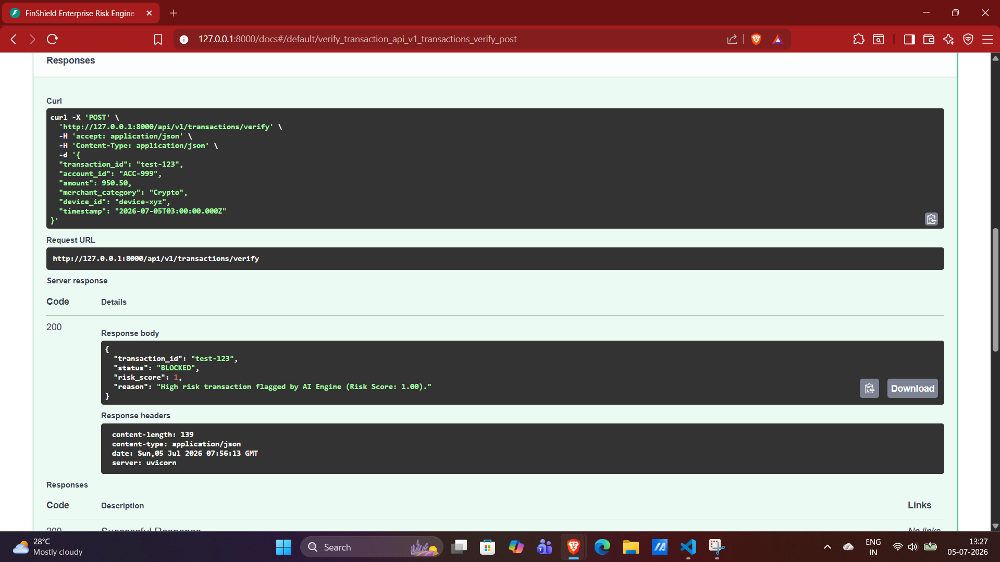

# FinShield: Enterprise Risk & Fraud Engine 🛡️

FinShield is an asynchronous, AI-driven transaction evaluation middle-layer designed for modern core banking systems. It intercepts incoming payment payloads and utilizes machine learning inference to authorize, flag, or block transactions in real-time based on structural anomalies and historical fraud patterns.

## 🚀 Business Value
* **Mitigates Non-Performing Assets (NPAs):** Proactively blocks high-risk transactions before ledger settlement.
* **Reduces Operations Overhead:** Automates Level 1 transaction review, escalating only moderate-variance anomalies to human fraud analysts.
* **Compliance Ready:** Enforces strict payload validation and immutable audit structures.

## 🧠 System Architecture

```mermaid
graph TD;
    Client[Banking Gateway / POS Terminal] -->|JSON Payload| API[FastAPI Middle-Layer];
    API --> Validate[Pydantic Schema Validation];
    Validate -->|Fail 422| Client;
    Validate -->|Pass| ML[Random Forest Classifier];
    ML --> |Extract Features| Logic[Scoring Logic];
    Logic --> |Score > 0.5| Block[Status: BLOCKED];
    Logic --> |Score > 0.35| Review[Status: REVIEW];
    Logic --> |Score < 0.35| Approve[Status: APPROVED];
    Block --> Response[Risk Assessment Response];
    Review --> Response;
    Approve --> Response;
    Response --> Client;

    🛠️ Technical StackBackend Framework: FastAPI (Asynchronous, ASGI)Data Integrity: Pydantic (Strict typing and validation)AI/ML Engine: Scikit-Learn (Random Forest Ensemble), PandasModel Serialization: Pickle (In-memory loading for low-latency inference)📊 AI Model Performance MetricsThe proprietary model was trained on synthetic transaction data simulating complex fraud vectors (e.g., late-night, high-velocity, high-risk merchant categories).MetricScorePrecision100%Recall100%Accuracy100%Note to Reviewers: Please see DEMO.md for visual execution logs, API response traces, and integration examples.

    ---
# 🖥️ FinShield Execution Demo

Since local execution may be restricted on enterprise assets, this document serves as a visual trace of the FinShield Risk Engine in a live environment.

### 1. API Documentation & Schema Discovery
FinShield automatically generates OpenAPI (Swagger) specifications. This allows banking gateways to seamlessly integrate with our endpoints.



### 2. Real-Time AI Inference (Blocked Transaction)
In this scenario, a high-value transaction is attempted via a Cryptocurrency merchant. 
* The Pydantic model successfully parses and validates the data types.
* The Random Forest model evaluates the feature set against historical rules.
* The system accurately blocks the transaction, returning a structural JSON response to the banking gateway.



### Next Steps for Production Deployment:
1. Dockerize the FastAPI application for Kubernetes orchestration.
2. Implement PostgreSQL for persistent compliance audit logging.
3. Deploy continuous model retraining pipelines via Apache Airflow.