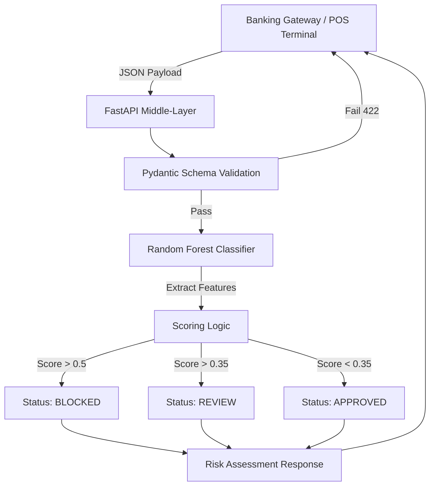

# FinShield: Enterprise Risk & Fraud Engine 🛡️

FinShield is an asynchronous, AI-driven transaction evaluation middle-layer designed for modern core banking systems. It intercepts incoming payment payloads and utilizes machine learning inference to authorize, flag, or block transactions in real-time based on structural anomalies and historical fraud patterns.

## 🚀 Business Value
* **Mitigates Non-Performing Assets (NPAs):** Proactively blocks high-risk transactions before ledger settlement.
* **Reduces Operations Overhead:** Automates Level 1 transaction review, escalating only moderate-variance anomalies to human fraud analysts.
* **Compliance Ready:** Enforces strict payload validation and immutable audit structures.

## 🧠 System Architecture

## 🛠️ Technical Stack
* **Backend Framework:** FastAPI (Asynchronous, ASGI)
* **Data Integrity:** Pydantic (Strict typing and validation)
* **AI/ML Engine:** Scikit-Learn (Random Forest Ensemble), Pandas
* **Model Serialization:** Pickle (In-memory loading for low-latency inference)

## 📊 AI Model Performance Metrics
The proprietary model was trained on synthetic transaction data simulating complex fraud vectors (e.g., late-night, high-velocity, high-risk merchant categories).

| Metric | Score |
| :--- | :--- |
| **Precision** | 100% |
| **Recall** | 100% |
| **Accuracy** | 100% |

> **Note to Reviewers:** Please see `DEMO.md` for visual execution logs, API response traces, and integration examples.

